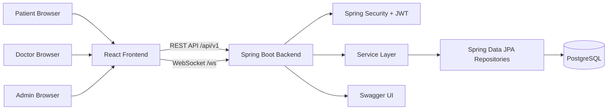
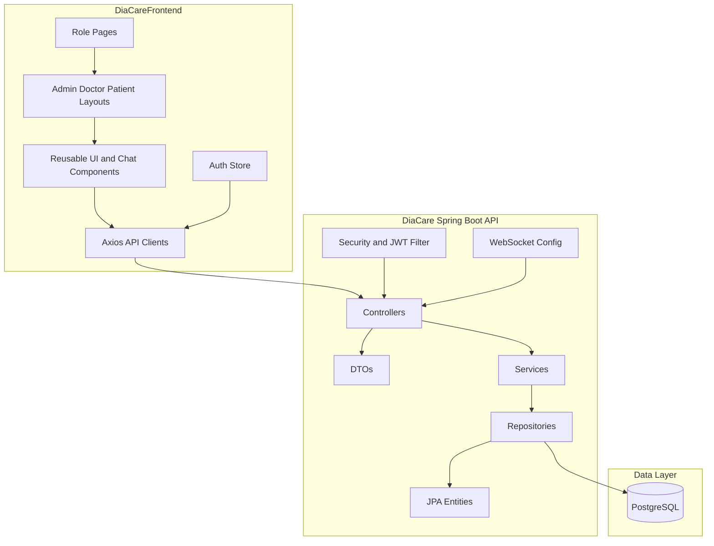
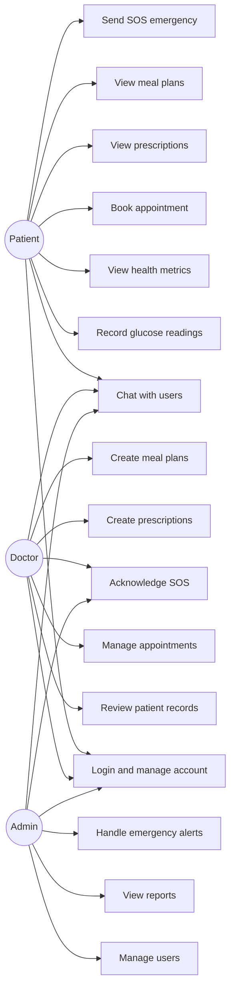
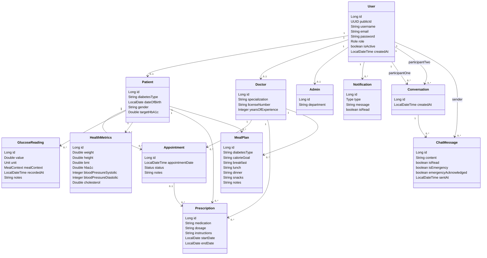
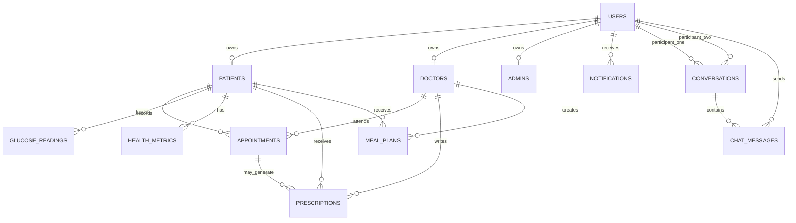
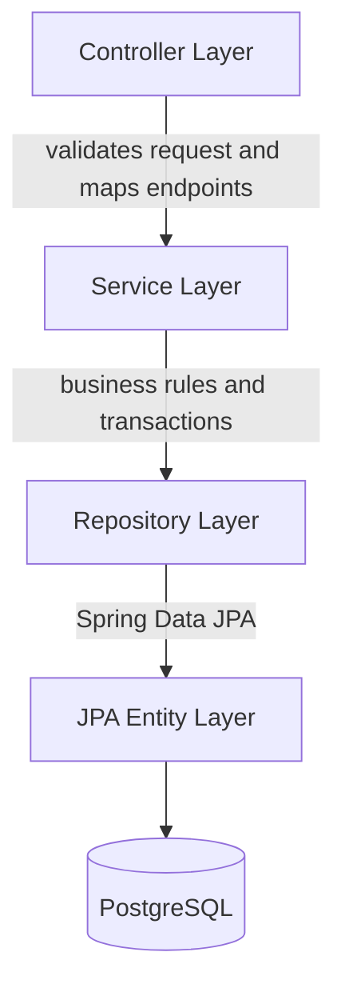
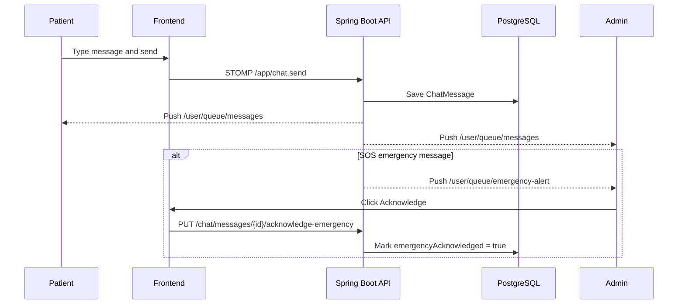
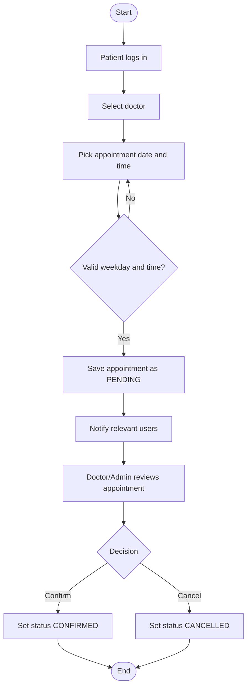
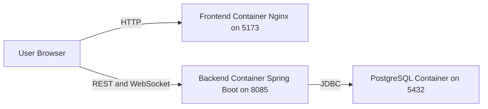

# DiaCare

DiaCare is a diabetes care management system designed as a prototype for Rwanda Diabetics Association. The system supports patients, doctors, and administrators with secure access to health records, glucose tracking, appointments, prescriptions, meal plans, notifications, dashboards, and real-time chat with SOS emergency escalation.

## Reference Organization

The reference organization for this project is Rwanda Diabetics Association. DiaCare is modeled as a digital support platform for an organization that coordinates diabetes care, patient follow-up, doctor communication, health education, and emergency response support.

## Main Features

- JWT-based authentication and role-based authorization
- Patient, doctor, and admin dashboards
- Patient profile management
- Glucose reading capture and history
- Health metrics tracking, including BMI and HbA1c
- Appointment booking, rescheduling, cancellation, and review
- Prescription and meal plan management
- Notifications
- Real-time chat using WebSocket, STOMP, and SockJS
- Patient SOS emergency messages with admin alerts and acknowledgement
- Dockerized deployment with PostgreSQL, Spring Boot, React, and Nginx

## Technology Stack

| Layer | Technology |
| --- | --- |
| Frontend | React, Vite, Tailwind CSS, Axios, React Router, Recharts |
| Backend | Spring Boot, Spring Security, Spring Data JPA, WebSocket/STOMP |
| Database | PostgreSQL |
| Auth | JWT |
| Deployment | Docker and Docker Compose |
| API Docs | Swagger/OpenAPI |

## Project Structure

```text
shema-placid/
  DiaCare/                  Spring Boot backend
  DiaCareFrontend/          React/Vite frontend
  docker-compose.yml        Full stack Docker orchestration
  PROJECT_DOCUMENTATION.md  Development, Docker, and test documentation
  STUDENT_MANUAL.md         Student-friendly explanation
  clear-db.sql              Database helper script
```

## Quick Start With Docker

Requirements:

- Docker
- Docker Compose

Run the complete application:

```bash
docker compose up --build
```

Open:

- Frontend: `http://localhost:5173`
- Backend Swagger UI: `http://localhost:8085/swagger-ui.html`
- Backend API base URL: `http://localhost:8085/api/v1`

Stop the stack:

```bash
docker compose down
```

## Default Test Users

The backend seed data prints these accounts during startup:

| Role | Email | Password |
| --- | --- | --- |
| Admin | `admin@diacare.com` | `Admin@123` |
| Doctor | `mugisha@diacare.com` | `Doctor@123` |
| Patient | `jean@diacare.com` | `Patient@123` |
| Patient | `alice@diacare.com` | `Patient@123` |

## Run Locally Without Docker

Backend:

```bash
cd DiaCare
mvn spring-boot:run
```

Frontend:

```bash
cd DiaCareFrontend
npm install
npm run dev
```

The backend requires PostgreSQL and environment variables for database, JWT, and mail settings. Docker Compose is the recommended development setup because it provides all services together.

## Architecture Diagram



## Component Diagram



## Use Case Diagram



## Class Diagram



## Entity Relationship Diagram



## Backend Layer Diagram



## Chat Sequence Diagram



## Appointment Activity Diagram



## Deployment Diagram



## API Summary

| Module | Main Paths |
| --- | --- |
| Authentication | `/api/v1/auth/**` |
| Admin | `/api/v1/admin/**` |
| Doctor | `/api/v1/doctors/**` |
| Patient | `/api/v1/patients/**` |
| Appointments | `/api/v1/appointments/**` |
| Glucose | `/api/v1/glucose/**` |
| Metrics | `/api/v1/metrics/**` |
| Prescriptions | `/api/v1/prescriptions/**` |
| Meal Plans | `/api/v1/meal-plans/**` |
| Notifications | `/api/v1/notifications/**` |
| Chat | `/api/v1/chat/**` |
| WebSocket | `/ws` |

## Design Patterns And Best Practices

- Repository Pattern through Spring Data JPA repositories
- Service Layer Pattern for business logic and transactions
- DTO Pattern for request and response data transfer
- Observer-style messaging through WebSocket subscriptions
- Centralized exception handling
- Environment-based configuration
- Role-based access control
- Component-based frontend structure
- Docker multi-container deployment

## Testing

Recommended checks:

```bash
cd DiaCare
mvn clean test

cd ../DiaCareFrontend
npm run build

cd ..
docker compose up --build
```

Main workflows to test:

- Register and log in as each role
- Access protected pages with and without a token
- Record glucose readings and health metrics
- Book and manage appointments
- Create and view prescriptions and meal plans
- Send normal chat messages between two browser sessions
- Send an SOS emergency message as a patient
- Acknowledge SOS as doctor or admin
- Confirm unread badges update correctly

## Submission Notes

For academic submission, include:

- This README
- `PROJECT_DOCUMENTATION.md`
- `STUDENT_MANUAL.md`
- Source code for both `DiaCare` and `DiaCareFrontend`
- `docker-compose.yml`
- Any database helper scripts

The project demonstrates prototype development, software design diagrams, Dockerization, version control setup, test planning, and implementation of selected programming best practices.
